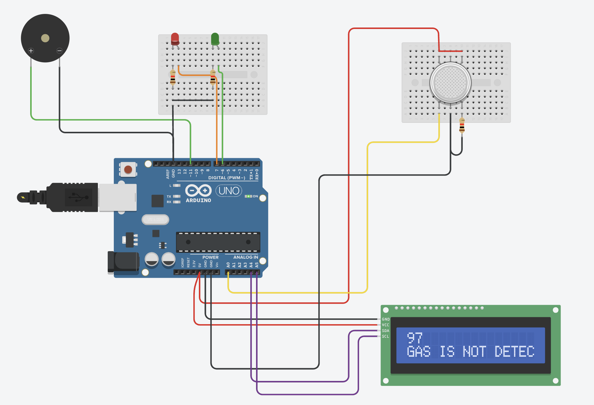
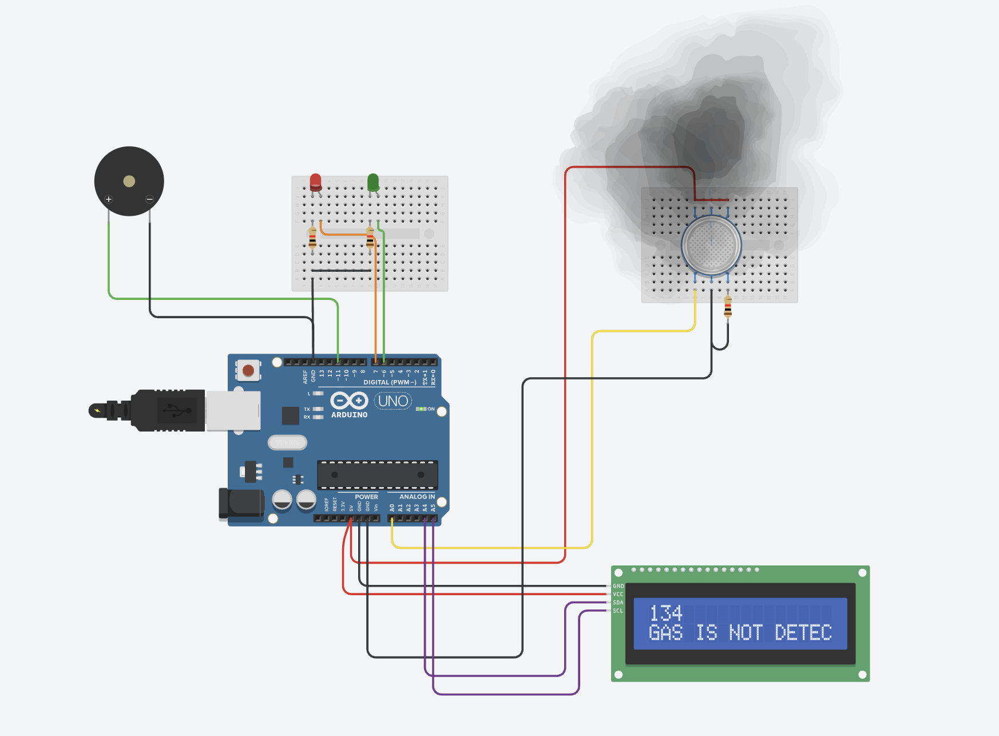
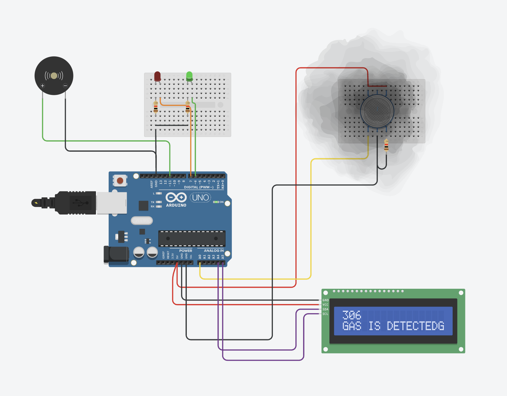

# Gas Leakage Detection System

An Arduino-based gas leakage detection system designed and simulated using Tinkercad Circuits.

The system monitors gas levels using a gas sensor and provides visual and audible alerts through an LCD, LEDs, and a buzzer.

## Features

- Real-time gas level monitoring
- 16x2 I2C LCD display
- Green LED for safe condition
- Red LED for warning and danger conditions
- Buzzer alarm
- Serial Monitor gas-level readings
- Tinkercad simulation

## Components Used

- Arduino UNO
- Gas Sensor
- 16x2 I2C LCD
- Green LED
- Red LED
- Buzzer
- 220Ω Resistors
- Breadboard
- Jumper Wires

## Pin Connections

| Component | Arduino Pin |
|---|---|
| Gas Sensor AO | A0 |
| Green LED | D6 |
| Red LED | D7 |
| Buzzer | D8 |
| LCD SDA | A4 |
| LCD SCL | A5 |
| LCD VCC | 5V |
| LCD GND | GND |
| Gas Sensor VCC | 5V |
| Gas Sensor GND | GND |

## Working

The gas sensor continuously measures the gas level and sends an analog value to the Arduino.

The Arduino compares the sensor reading with predefined threshold values.

### Safe Condition

- Green LED ON
- Red LED OFF
- Buzzer OFF
- LCD displays `STATUS: SAFE`

### Warning Condition

- Green LED OFF
- Red LED blinks
- Buzzer beeps
- LCD displays `STATUS: WARNING`

### Danger Condition

- Green LED OFF
- Red LED ON
- Buzzer alarm
- LCD displays `GAS LEAK!`

## Circuit Connections



## Safe Condition



## Gas Leakage Condition



## Tinkercad Simulation

[Open Tinkercad Simulation](https://www.tinkercad.com/things/aqviqb0OaLd/editel)

## Project Structure

```text
Gas-Leakage-Detection-System/
│
├── README.md
├── gas_leakage_detection.ino
├── 01-circuit-connections.png
├── 02-safe-condition.png
└── 03-gas-leakage-condition.png

## Tinkercad Simulation

You can view and run the complete circuit simulation here:

[Open Tinkercad Project](https://www.tinkercad.com/things/aqviqb0OaLd/editel)
